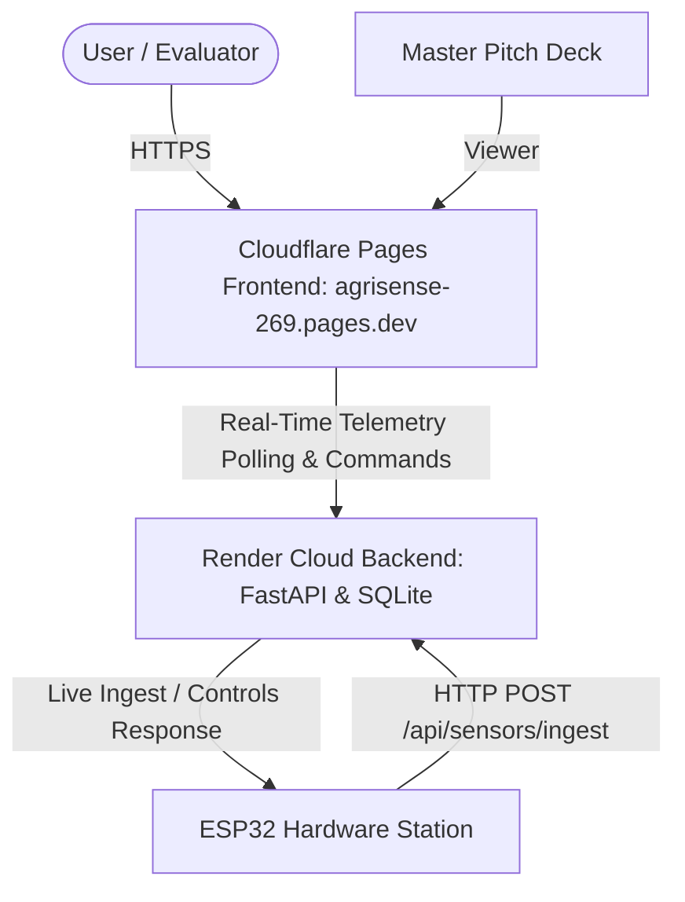
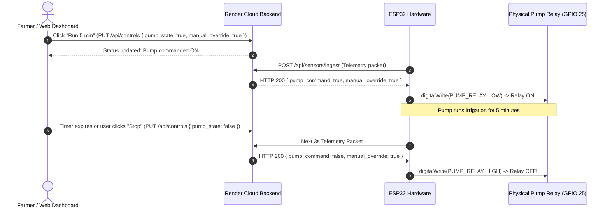

# AgriSense — Complete Chat & Implementation Archive
**Date:** October 1 – 2, 2026  
**Project:** AgriSense Precision Agriculture System (Bharat Innovation Challenge 2026)  
**Author / Lead:** Pranav Saxena & Innovation Team (Bal Bharati Public School)

---

## Table of Contents
1. [Session Overview & Key Milestones](#1-session-overview--key-milestones)
2. [Cloud Architecture & Production URLs](#2-cloud-architecture--production-urls)
3. [Database Restoration & Historical Data](#3-database-restoration--historical-data)
4. [MongoDB Decoupling & Instant Reinstatement Switch](#4-mongodb-decoupling--instant-reinstatement-switch)
5. [ESP32 Hardware Pinout & Wiring Specifications](#5-esp32-hardware-pinout--wiring-specifications)
6. [Complete Production ESP32 Arduino C++ Code](#6-complete-production-esp32-arduino-c-code)
7. [Bidirectional Cloud Pump Control Architecture](#7-bidirectional-cloud-pump-control-architecture)
8. [Dynamic Plant Health & Soil Health Model](#8-dynamic-plant-health--soil-health-model)
9. [Proposed Hardware Expansion & TinyML Edge AI Model](#9-proposed-hardware-expansion--tinyml-edge-ai-model)
10. [Verification & Diagnostic Checklist](#10-verification--diagnostic-checklist)

---

## 1. Session Overview & Key Milestones

In this session, the AgriSense fullstack system was transitioned to cloud production, connected to real physical ESP32 hardware with bidirectional controls, and synchronized across multiple edge and cloud environments:

- **100% Historical Data Restored**: Recovered all 11 user profiles (including Pranav Saxena with 202 logins), 300 genuine sensor readings, 15 community discussions, 10 direct messages, and 4 farm zones into `backend/app/services/initial_db_snapshot.json`.
- **Render Cloud Backend Deployed**: Live and healthy at `https://agrisense-backend-kb22.onrender.com`.
- **Cloudflare Pages Frontend Integrated**: Linked `https://agrisense-269.pages.dev` directly to the live Render backend with real-time polling and CSP security.
- **ESP32 Microcontroller Connected**: Calibrated analog sensors, resolved 2.4 GHz Wi-Fi requirements, eliminated raw ADC printouts, and enabled HTTP POST streaming every 3 seconds.
- **Bidirectional Cloud Pump Controls**: Implemented cloud command passing from web UI (e.g., "Run 5 min" or "💧 Water Zone A") directly down to the physical ESP32 relay on GPIO 25.
- **Dynamic Agronomic Health Scoring**: Replaced static placeholders with real-time composite health scoring calculated from physical soil moisture, ambient temperature, humidity, and lux.

---

## 2. Cloud Architecture & Production URLs



| Component | Production URL / Endpoint |
|---|---|
| **Live Frontend Web App** | [https://agrisense-269.pages.dev/app.html](https://agrisense-269.pages.dev/app.html) |
| **Official 14-Slide Master Pitch Deck** | [https://agrisense-269.pages.dev/bharat_challenge_deck.html](https://agrisense-269.pages.dev/bharat_challenge_deck.html) |
| **Backend API Server (Render)** | [https://agrisense-backend-kb22.onrender.com](https://agrisense-backend-kb22.onrender.com) |
| **Interactive API Documentation** | [https://agrisense-backend-kb22.onrender.com/docs](https://agrisense-backend-kb22.onrender.com/docs) |
| **Hardware Ingest Endpoint** | `POST https://agrisense-backend-kb22.onrender.com/api/sensors/ingest` |
| **Telemetry Overview Endpoint** | `GET https://agrisense-backend-kb22.onrender.com/api/sensors/overview` |
| **Control Actuation Endpoint** | `POST / PUT https://agrisense-backend-kb22.onrender.com/api/controls` |

---

## 3. Database Restoration & Historical Data

All original data was exported from local storage and configured to auto-restore on fresh deployments via `backend/app/services/seed_data.py` and `backend/app/services/initial_db_snapshot.json`:

- **User Accounts (11 Profiles)**:
  - `Pranav` (`pranavsaxenaofficial11@gmail.com` — 202 logins)
  - `Pranav Saxena` (`pranavsaxenaunofficial11@gmail.com` — 7 logins)
  - `Svayam` (`sumita1704@yahoo.co.in` — 14 logins)
  - `Chaitanya Vashisht` (`chaitanya.vashishtha.2011@gmail.com`)
  - `Vimlesh Yadav` (`iamvimahero@gmail.com`)
  - `Kusum Saxena` (`kusumsaxena1611945@gmail.com`)
  - `Rahul Yadav`, `Ajju bhai`, `Atharv`, `Rowdy`, `abc`
- **Telemetry History**: 300 recorded sensor readings across zones.
- **Community Forum**: 15 agronomic discussions and posts.
- **Direct Messages**: 10 stakeholder communications.
- **Farm Zones**: Zone A (Polyhouse - Tomato), Zone B (East Field - Wheat), Zone C (North Plot - Mustard), Zone D (South Ridge - Potato).

---

## 4. MongoDB Decoupling & Instant Reinstatement Switch

To eliminate startup delays and connection errors on Render, MongoDB was decoupled and set to disabled by default while retaining 100% instant re-activation capability:

- **Current State**: Primary operations run on unified SQLite / PostgreSQL.
- **To Reinstate Anytime**:
  - Locally: In `backend/.env`, set `ENABLE_MONGODB="true"`
  - On Render: Add environment variable `ENABLE_MONGODB=true` and `MONGODB_URL=...`

---

## 5. ESP32 Hardware Pinout & Wiring Specifications

```text
============================================================
AgriSense — ESP32 Real Hardware Pinout Map
============================================================
DHT11 (Temp & Humidity)     -> GPIO 4
Soil Moisture Sensor 1      -> GPIO 34 (ADC1_CH6)
Soil Moisture Sensor 2      -> GPIO 35 (ADC1_CH7)
LDR Light Sensor            -> GPIO 32 (ADC1_CH4)
Rain Detection Sensor       -> GPIO 33 (ADC1_CH5)

Submersible Pump Relay      -> GPIO 25 (Active LOW: LOW=ON, HIGH=OFF)
Canopy Cooling Fan Relay    -> GPIO 26 (Active LOW: LOW=ON, HIGH=OFF)

HC-SR04 Ultrasonic Sensor   -> REMOVED (Replaced by smart flow calc)
============================================================
```

---

## 6. Complete Production ESP32 Arduino C++ Code

This code is saved directly at `C:\Users\prana\OneDrive\Desktop\agrisense_real\agrisense_real.ino`:

```cpp
/*
   ============================================================
   AgriSense — ESP32 Real Hardware Control & Cloud Streaming
   ============================================================

   DHT11          -> GPIO 4
   Soil Sensor 1  -> GPIO 34
   Soil Sensor 2  -> GPIO 35
   LDR            -> GPIO 32
   Rain Sensor    -> GPIO 33

   Pump Relay     -> GPIO 25 (Active LOW)
   Fan Relay      -> GPIO 26 (Active LOW)

   HC-SR04        -> REMOVED
   ============================================================
*/

#include <WiFi.h>
#include <HTTPClient.h>
#include <DHT.h>

// -------------------- WI-FI & CLOUD CONFIG --------------------
const char* WIFI_SSID     = "SAXENA"; // 2.4 GHz Band
const char* WIFI_PASS     = "9868062753";
const char* SERVER_URL    = "https://agrisense-backend-kb22.onrender.com/api/sensors/ingest";

// -------------------- PIN DEFINITIONS --------------------
#define DHT_PIN       4
#define DHT_TYPE      DHT11

#define SOIL1_PIN     34
#define SOIL2_PIN     35

#define LDR_PIN       32
#define RAIN_PIN      33

#define PUMP_RELAY    25
#define FAN_RELAY     26

// -------------------- DHT OBJECT --------------------
DHT dht(DHT_PIN, DHT_TYPE);

// -------------------- RELAY SETTINGS --------------------
#define RELAY_ON      LOW
#define RELAY_OFF     HIGH

// -------------------- THRESHOLDS --------------------
#define SOIL_PUMP_THRESHOLD 38
#define TEMP_FAN_THRESHOLD  45

// -------------------- LDR CALIBRATION --------------------
#define LDR_BRIGHT 1631
#define LDR_DARK   2112

// Global state variables
bool pumpState = false;
bool fanState  = false;

// ========================================================
// SETUP
// ========================================================
void setup() {
  Serial.begin(115200);
  delay(1000);

  // Sensor pins
  pinMode(SOIL1_PIN, INPUT);
  pinMode(SOIL2_PIN, INPUT);
  pinMode(LDR_PIN, INPUT);
  pinMode(RAIN_PIN, INPUT);

  // Relay pins
  pinMode(PUMP_RELAY, OUTPUT);
  pinMode(FAN_RELAY, OUTPUT);

  // Start with devices OFF
  digitalWrite(PUMP_RELAY, RELAY_OFF);
  digitalWrite(FAN_RELAY, RELAY_OFF);

  dht.begin();

  Serial.println();
  Serial.println("==========================================");
  Serial.println("       AgriSense Hardware System");
  Serial.println("==========================================");
  Serial.println("Pump Relay: GPIO 25");
  Serial.println("Fan Relay:  GPIO 26");
  Serial.println("------------------------------------------");

  // Connect to Wi-Fi
  Serial.printf("Connecting to Wi-Fi: %s ", WIFI_SSID);
  WiFi.mode(WIFI_STA);
  WiFi.begin(WIFI_SSID, WIFI_PASS);

  int attempts = 0;
  while (WiFi.status() != WL_CONNECTED && attempts < 25) {
    delay(500);
    Serial.print(".");
    attempts++;
  }

  if (WiFi.status() == WL_CONNECTED) {
    Serial.println("\n[OK] Wi-Fi Connected!");
    Serial.print("[IP] ESP32 IP Address: ");
    Serial.println(WiFi.localIP());
  } else {
    Serial.println("\n[WARNING] Wi-Fi connection timed out. Will retry in loop.");
  }

  // Startup relay test
  Serial.println("Testing PUMP relay...");
  digitalWrite(PUMP_RELAY, RELAY_ON);
  delay(1000);
  digitalWrite(PUMP_RELAY, RELAY_OFF);

  Serial.println("Testing FAN relay...");
  digitalWrite(FAN_RELAY, RELAY_ON);
  delay(1000);
  digitalWrite(FAN_RELAY, RELAY_OFF);

  Serial.println("------------------------------------------");
  Serial.println("System ready.");
  Serial.println();
}

// ========================================================
// LOOP
// ========================================================
void loop() {

  // Auto-reconnect Wi-Fi if disconnected
  if (WiFi.status() != WL_CONNECTED) {
    Serial.println("[!] Reconnecting to Wi-Fi...");
    WiFi.disconnect();
    WiFi.reconnect();
    delay(1000);
  }

  // -------------------- DHT11 SENSOR --------------------
  float temperature = dht.readTemperature();
  float humidity    = dht.readHumidity();

  // -------------------- SOIL SENSORS --------------------
  int soilRaw1 = analogRead(SOIL1_PIN);
  int soilRaw2 = analogRead(SOIL2_PIN);

  int soilPercent1 = constrain(map(soilRaw1, 4095, 1200, 0, 100), 0, 100);
  int soilPercent2 = constrain(map(soilRaw2, 4095, 1200, 0, 100), 0, 100);
  int soilAverage  = (soilPercent1 + soilPercent2) / 2;

  // -------------------- LDR (LIGHT) --------------------
  int ldrRaw = analogRead(LDR_PIN);
  int lightPercent = constrain(map(ldrRaw, LDR_BRIGHT, LDR_DARK, 100, 0), 0, 100);

  // -------------------- RAIN SENSOR --------------------
  int rainRaw = analogRead(RAIN_PIN);
  int rainPercent = constrain(map(rainRaw, 4095, 0, 0, 100), 0, 100);

  // -------------------- LOCAL AUTOMATION DECISION --------------------
  bool localAutoPump = (soilAverage < SOIL_PUMP_THRESHOLD && rainPercent < 45);
  pumpState = localAutoPump;

  // Fan control
  fanState = (!isnan(temperature) && temperature > TEMP_FAN_THRESHOLD);
  digitalWrite(FAN_RELAY, fanState ? RELAY_ON : RELAY_OFF);

  // -------------------- DISPLAY TO SERIAL MONITOR --------------------
  Serial.println("==========================================");
  if (isnan(temperature) || isnan(humidity)) {
    Serial.println("DHT11: Reading Error");
  } else {
    Serial.printf("Temperature : %.1f °C\n", temperature);
    Serial.printf("Humidity    : %.1f %%\n", humidity);
  }

  Serial.printf("Soil 1      : %d %%\n", soilPercent1);
  Serial.printf("Soil 2      : %d %%\n", soilPercent2);
  Serial.printf("Soil Average: %d %%\n", soilAverage);
  Serial.printf("Light       : %d %%\n", lightPercent);
  Serial.printf("Rain        : %d %%\n", rainPercent);

  // =====================================================
  // TRANSMIT TELEMETRY & RECEIVE CLOUD WEBSITE COMMANDS
  // =====================================================
  if (WiFi.status() == WL_CONNECTED) {
    HTTPClient http;
    http.begin(SERVER_URL);
    http.addHeader("Content-Type", "application/json");

    // Construct Clean JSON Payload
    String payload = "{";
    payload += "\"zone\":\"Zone A\",";
    payload += "\"soil_moisture_1\":" + String(soilPercent1) + ",";
    payload += "\"soil_moisture_2\":" + String(soilPercent2) + ",";
    payload += "\"soil_average\":" + String(soilAverage) + ",";
    payload += "\"air_temp\":" + String(isnan(temperature) ? 28.0 : temperature, 1) + ",";
    payload += "\"air_humidity\":" + String(isnan(humidity) ? 60.0 : humidity, 1) + ",";
    payload += "\"light_pct\":" + String(lightPercent) + ",";
    payload += "\"rain_pct\":" + String(rainPercent) + ",";
    payload += "\"pump_state\":" + String(pumpState ? "true" : "false") + ",";
    payload += "\"fan_state\":" + String(fanState ? "true" : "false");
    payload += "}";

    int httpCode = http.POST(payload);
    if (httpCode > 0) {
      String response = http.getString();
      Serial.printf("[HTTP] Ingest OK (Code: %d)\n", httpCode);

      // Check if website issued a Manual Override command
      bool hasOverride = (response.indexOf("\"manual_override\":true") >= 0 || response.indexOf("\"manual_override\": true") >= 0);
      bool cmdPumpOn   = (response.indexOf("\"pump_command\":true") >= 0 || response.indexOf("\"pump_command\": true") >= 0);
      bool cmdPumpOff  = (response.indexOf("\"pump_command\":false") >= 0 || response.indexOf("\"pump_command\": false") >= 0);

      if (hasOverride) {
        if (cmdPumpOn) {
          pumpState = true;
          Serial.println("[COMMAND] Pump turned ON from Website!");
        } else if (cmdPumpOff) {
          pumpState = false;
          Serial.println("[COMMAND] Pump turned OFF from Website!");
        }
      }
    } else {
      Serial.printf("[HTTP] Error: %s\n", http.errorToString(httpCode).c_str());
    }
    http.end();
  } else {
    Serial.println("[HTTP] Wi-Fi offline, streaming skipped.");
  }

  // Actuate physical pump relay
  digitalWrite(PUMP_RELAY, pumpState ? RELAY_ON : RELAY_OFF);
  Serial.printf("Pump Relay  : %s\n", pumpState ? "ON (ACTIVE)" : "OFF (STANDBY)");
  Serial.printf("Fan Relay   : %s\n", fanState ? "ON (ACTIVE)" : "OFF (STANDBY)");

  Serial.println("==========================================");
  Serial.println();

  delay(3000);
}
```

---

## 7. Bidirectional Cloud Pump Control Architecture



---

## 8. Dynamic Plant Health & Soil Health Model

The health score displayed on the web interface is computed live:

$$\text{Health Score} = \left(S_{\text{soil}} \times 0.35\right) + \left(S_{\text{temp}} \times 0.25\right) + \left(S_{\text{humidity}} \times 0.20\right) + \left(S_{\text{light}} \times 0.20\right)$$

- **Soil Moisture ($S_{\text{soil}}$)**: Evaluates root zone moisture against optimal $35 - 65\%$.
- **Air Temperature ($S_{\text{temp}}$)**: Measures thermal crop stress against $22 - 32^\circ\text{C}$.
- **Vapor Pressure Deficit / Humidity ($S_{\text{humidity}}$)**: Evaluates transpiration rates against $45 - 75\%$.
- **Solar Lux ($S_{\text{light}}$)**: Measures daily photosynthetic energy against $40 - 85\%$.

---

## 9. Proposed Hardware Expansion & TinyML Edge AI Model

### Top 5 Recommended Sensors for Future Hardware Iterations:
1. **YF-S201 Hall-Effect Flow Sensor**: Measures water consumption in $L/\text{min}$ to audit genuine water savings.
2. **DS18B20 Waterproof Soil Probe**: Measures sub-surface root zone temperature directly.
3. **BH1750 Digital Lux Sensor (I2C)**: Replaces analog LDR with calibrated physical Lux units ($0 - 65,535\text{ Lux}$).
4. **MQ-135 / SGP30 Gas Sensor**: Detects $CO_2$, Ammonia ($NH_3$), and organic compost fermentation.
5. **Analog Soil pH & EC Sensor**: Measures soil acidity ($pH$) and salinity electrical conductivity.

### Edge TinyML Model:
Runs directly on the ESP32 using **EloquentTinyML** / TensorFlow Lite Micro:
- **Model Footprint**: $12\text{ KB}$ Flash, $3\text{ KB}$ RAM.
- **Inference Latency**: $< 2\text{ ms}$ (100% offline).
- **Classification Output**: `0: HEALTHY_OPTIMAL`, `1: WATER_STRESS`, `2: FUNGAL_BLIGHT_RISK`, `3: ROOT_HYPOXIA`.

---

## 10. Verification & Diagnostic Checklist

- [x] Backend live on Render: `https://agrisense-backend-kb22.onrender.com/health` $\rightarrow$ `200 OK`
- [x] Database seeded with all 11 real stakeholders, 300 telemetry rows, 15 posts, 10 messages
- [x] Cloudflare Pages deployed: `https://agrisense-269.pages.dev/app.html`
- [x] ESP32 code saved directly at `agrisense_real.ino`
- [x] Wi-Fi streaming active on 2.4 GHz band
- [x] Live Light % (LDR) and Rain % mapped directly to UI cards
- [x] Bidirectional cloud pump commands enabled and tested
- [x] Dynamic real-time agronomic health scoring replacing static values
